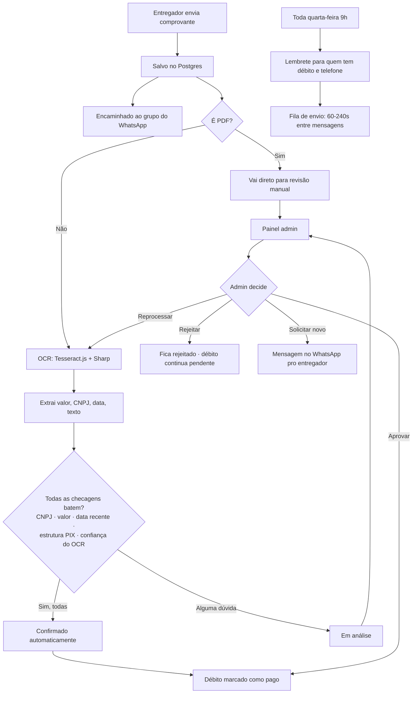

# ERP Fiado Empresarial

Sistema de controle de fiado (gastos a prazo) de funcionários e
entregadores, com painel administrativo, desempenho e relatórios em PDF.

Banco de dados: **Postgres via Supabase** (não usa mais SQLite — ver
seção "Banco de dados" abaixo para o motivo).

## Instalação

```bash
npm install
```

---

## Configurar o `.env`

Copie `.env.example` para `.env` e preencha:

- `JWT_SECRET`, `ADMIN_USER`, `ADMIN_PASSWORD` — como antes.
- Dados de conexão do Supabase — **prefira os campos separados**
  (`PGHOST`/`PGPORT`/`PGUSER`/`PGPASSWORD`/`PGDATABASE`) em vez de um
  `DATABASE_URL` único. Se a senha do banco tiver caractere especial
  (`#`, `@`, `%`, `/`, `:`), colar tudo numa única URL costuma quebrar a
  conexão de forma confusa ("password authentication failed" mesmo com a
  senha certa) — foi exatamente isso que aconteceu ao configurar este
  projeto, e os campos separados resolveram.
- Use o host do **"Transaction pooler"** do Supabase (Project Settings →
  Database → Connection parameters), não o "Direct connection" — o
  direct connection só responde em IPv6 e falha em redes sem suporte a
  IPv6 (erro `ENOTFOUND`).

## Rodar o sistema

```bash
npm run dev
```

## Abrir no navegador

```txt
http://localhost:3000
```

---

# Login Admin

Usuário e senha ficam no `.env` (`ADMIN_USER` / `ADMIN_PASSWORD`) e o
usuário admin é criado automaticamente na primeira vez que o servidor
sobe, caso ainda não exista.

---

# Recursos

- Login admin / funcionários / entregadores (JWT + bcrypt)
- Cadastro de funcionários e entregadores, em seções separadas
- Controle de fiado por pessoa e por empresa
- Totais, desempenho e relatórios em PDF (financeiro completo, por
  funcionário e por entregador)
- Filtro de histórico por ano e mês
- Reset de sistema protegido por senha real + confirmação, com backup
  automático em JSON antes de apagar
- **Módulo financeiro do entregador**: pagamento via PIX, envio de
  comprovante, validação automática por OCR, encaminhamento ao WhatsApp,
  painel de aprovação e lembrete semanal automático (ver seção própria
  abaixo)

---

# Módulo financeiro de entregadores (WhatsApp + OCR)

## Como funciona, do ponto de vista do entregador

1. Entregador loga e vê a aba **Financeiro**: débito atual, situação
   (em dia/pendente), histórico de débitos e pagamentos.
2. Clica em **Pagar Débito** → vê o valor e a chave PIX (com botão de
   copiar) → paga → clica em **Já Realizei o Pagamento**.
3. Envia o comprovante (JPG, PNG, WEBP ou PDF, até 8 MB).
4. O sistema:
   - salva o arquivo (no Postgres, não em disco — ver "Armazenamento
     do arquivo" abaixo);
   - encaminha automaticamente pro grupo do WhatsApp configurado
     (texto com os dados do entregador + a imagem do comprovante);
   - roda OCR na imagem e valida automaticamente contra o CNPJ, o
     valor do débito e a data;
   - se tudo bater, confirma sozinho e marca o débito como pago; se
     houver qualquer dúvida, deixa **"em análise"** para um admin
     revisar — nunca aprova automaticamente com dúvida.
5. Entregador vê o resultado na hora (confirmado ou em análise).

## Fluxograma



## Primeira conexão do WhatsApp

1. Suba o servidor (local ou Render).
2. Vá em **Entregadores → Comprovantes** no painel admin — aparece um
   card "Conexão WhatsApp" com um QR Code.
3. No celular com o número oficial da loja: WhatsApp → ⋮ → **Aparelhos
   conectados** → **Conectar um aparelho** → escaneie o QR Code.
4. Pronto — a sessão fica salva no Postgres e sobrevive a redeploys no
   Render (não precisa escanear de novo, a não ser que desconecte pelo
   celular).

O sistema busca automaticamente o grupo chamado exatamente como
`WHATSAPP_GRUPO_NOME` no `.env` (padrão: `Açaí clts`). Se existir mais
de um grupo com esse nome, o sistema **não escolhe sozinho** — fica
registrado um aviso, e um admin precisa fixar manualmente qual grupo
usar (`PUT /admin/whatsapp/grupo`, ou peça pra eu adicionar um botão
pra isso na tela se for um caso recorrente).

## Sobre o OCR (leitura automática do comprovante)

Usa **Tesseract.js** (motor de OCR gratuito, roda como WASM — sem
precisar instalar nada no servidor) com **Sharp** pré-processando a
imagem (escala de cinza, contraste, nitidez). É **mais fraco que IA
visual** (GPT-4 Vision, Google Vision) pra ler foto de celular — por
isso boa parte dos comprovantes deve cair em "em análise" pra revisão
manual, principalmente no começo. Isso é intencional: a regra seguida
à risca foi "nunca aprovar automaticamente com dúvida", e com um OCR
mais simples há mais dúvida, não menos segurança.

PDF não passa por OCR automático (Tesseract lê imagem, não PDF) — cai
direto em revisão manual.

## Armazenamento do arquivo

O comprovante é salvo como `BYTEA` direto no Postgres, não em disco
(que é efêmero no Render) nem em um serviço de storage à parte. É uma
escolha pragmática para o volume esperado (fotos/prints, poucos KB a
poucos MB cada); se o volume de comprovantes crescer muito no futuro,
migrar para um object storage (ex: Supabase Storage) é o próximo passo
natural — não é a única forma correta em qualquer escala.

## Lembrete semanal

Toda quarta-feira às 9h (horário de Brasília, fixo mesmo rodando no
Render em UTC), o sistema manda uma mensagem individual para cada
entregador com débito pendente **e** telefone cadastrado. As mensagens
passam por uma fila com atraso de 60 a 240 segundos entre cada uma (não
manda tudo de uma vez) — isso é limite operacional pra não sobrecarregar
o número, não uma tentativa de disfarçar automação.

Pra testar sem esperar quarta-feira: botão **"Disparar lembretes
agora"** na aba Comprovantes, ou `POST /admin/lembretes/executar`.

## Segurança do módulo

- Upload valida o tipo de arquivo pela **assinatura binária real**
  (magic bytes), não só pela extensão ou pelo Content-Type que o
  navegador informou.
- Limite de 8 MB por arquivo e de 6 envios a cada 15 minutos por
  entregador (evita sobrecarregar o pipeline de OCR).
- Toda rota do módulo exige login; as de entregador exigem
  especificamente `role=entregador`, as administrativas exigem
  `role=admin`.
- `app.set('trust proxy', true)` — necessário porque o Render (e o
  Cloudflare na frente dele) fica entre o navegador e o servidor; sem
  isso, `req.ip` mostraria sempre o IP do proxy, não o do usuário real,
  o que quebraria os limitadores de taxa (todo mundo pareceria vir do
  mesmo IP) e o campo `ip_envio` salvo em cada comprovante.
- Reprovar um comprovante nunca marca o débito como pago; um comprovante
  já confirmado não pode ser rejeitado depois (evita ficar com o
  comprovante "rejeitado" mas o débito já pago).
- Toda tentativa de envio ao WhatsApp fica registrada em
  `whatsapp_mensagens` (status, tentativas, erro) — dá pra auditar o
  que foi enviado, quando, e o que falhou.

---

# Banco de dados

O projeto foi migrado de SQLite para **Postgres (Supabase)** porque vai
rodar no Render, que usa **disco efêmero**: qualquer arquivo escrito em
tempo de execução (como seria o `database.db` do SQLite) é apagado a
cada deploy ou reinício do serviço. Hospedando o banco no Supabase, os
dados sobrevivem a qualquer deploy/restart do Render.

### Migrar dados de um `database.db` antigo (se existir)

```bash
npm run migrar:supabase
```

Copia todos os `users` e `gastos` do SQLite local para o Postgres
configurado no `.env`, preservando os ids (histórico intacto). Seguro
rodar mais de uma vez — registros já migrados não duplicam.

### Testar só a conexão

```bash
npm run testar:conexao
```

---

# Deploy no Render

1. Suba este repositório para o GitHub (já feito, se você seguiu os
   passos do projeto).
2. No Render, **New → Blueprint**, aponte para o repositório — ele lê o
   `render.yaml` deste projeto automaticamente.
3. Preencha os valores marcados como secretos no painel do Render
   (`JWT_SECRET`, `ADMIN_USER`, `ADMIN_PASSWORD`, `PGHOST`, `PGPORT`,
   `PGUSER`, `PGPASSWORD`, `PGDATABASE`) — os mesmos do seu `.env`.
4. **Sobre ficar 24h ligado**: o `render.yaml` está com `plan: free`.
   Nesse plano o Render derruba o serviço após ~15 min sem tráfego.
   Para evitar isso sem pagar, configure um bot de uptime (ex:
   [UptimeRobot](https://uptimerobot.com), gratuito) pingando a URL do
   serviço a cada 5 minutos — menos que o limite de 15 min, então o
   serviço nunca chega a dormir. Isso não é um "sempre ligado" oficial
   da Render (é um workaround comum, não uma garantia contratual): se
   o bot cair, ou a conta passar do teto de ~750h/mês do plano free,
   o serviço pode ficar indisponível por um tempo — nenhum dado é
   perdido nesse caso, só fica fora do ar até voltar. Para uma garantia
   de verdade, troque `plan: free` por `plan: starter` no
   `render.yaml` (pago, ~US$7/mês).

---

# Estrutura do projeto

```
server.js              # ponto de entrada: migra o banco, cria o admin, sobe o servidor e o job de lembrete
src/
  config/env.js        # carrega e valida variáveis de ambiente
  db/
    index.js           # conexão Postgres (pg.Pool) + wrappers em Promise
    schema.js           # criação de tabelas, índices, foreign keys
    seed.js              # cria o usuário admin padrão
  middleware/
    auth.js              # autenticação (JWT), checagem de admin/entregador
    asyncHandler.js       # evita repetir try/catch e evita crash do processo
    errorHandler.js        # resposta de erro padronizada
    rateLimiter.js          # fábrica de limitador de taxa (login e upload usam essa)
    loginRateLimiter.js      # limita tentativas de login
    securityHeaders.js        # cabeçalhos de segurança básicos
    uploadComprovante.js       # multer em memória + validação de assinatura binária
  services/
    pessoasService.js           # funcionários/entregadores (CRUD compartilhado)
    gastosService.js             # débitos/pagamentos
    relatoriosService.js          # totais e ranking (fonte única de cálculo)
    sistemaService.js              # reset do sistema
    comprovanteService.js           # upload, OCR, validação, aprovação/rejeição admin
    ocrService.js                    # Tesseract.js + Sharp
    comprovanteValidationService.js   # regras de aprovação automática
    whatsappService.js                 # conexão Baileys, envio de texto/imagem
    whatsappAuthStore.js                # sessão do Baileys persistida no Postgres
    whatsappGroupService.js              # busca do grupo pelo nome + cache do JID
    whatsappQueueService.js               # fila de envio com limite de taxa
  jobs/
    lembreteSemanalJob.js                 # node-cron: lembrete de débito toda quarta
  utils/
    comprovanteParser.js                   # extrai campos do texto do OCR
  routes/                  # rotas HTTP, finas, delegam para os services
scripts/
  migrar-sqlite-para-postgres.js   # migração única de dados
  testar-conexao-postgres.js       # smoke test da conexão
public/
  index.html, app.js, style.css   # frontend (sem build step)
backups/                            # backups gerados pelo reset do sistema (não versionado)
render.yaml                           # config de deploy no Render
```

Cada pasta em `src/` tem comentários explicando o "porquê" das decisões
tomadas — não só o "o quê".
